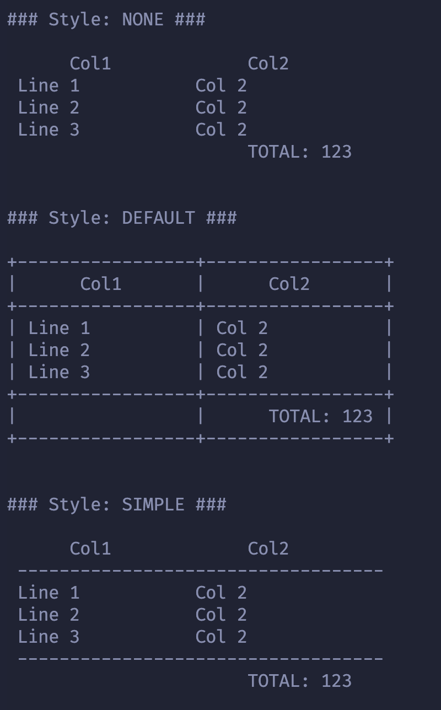

# Tyble
Helper to create table on terminal.

#### Example to create a table:
````ts
    import { Row, Table, TableStyle, TextAlign } from "@rkvcs/tyble";
    
    const header = new Row("Col1", "Col2")
    const footer = new Row("", "TOTAL: 123")
    
    header.setAlign(TextAlign.CENTER)
    footer.setAlign(TextAlign.RIGHT)
    
    const table = new Table({
        columns: 2,
        width: 15,
        tableStyle: TableStyle.DEFAULT
    })

    table.addHeader(header)
    table.addFooter(footer)
    
    table.add(new Row("Line 1", "Col 2"))
    table.add(new Row("Line 2", "Col 2"))
    table.add(new Row("Line 3", "Col 2"))

    table.border() // enable borders
    console.info(table.render())
````

output:

